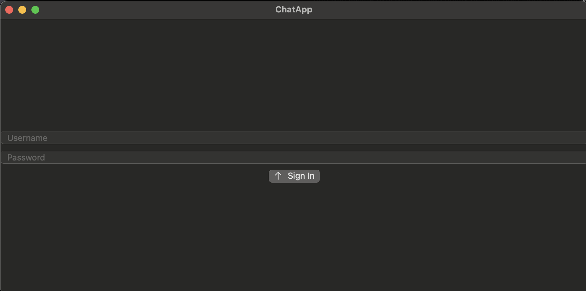
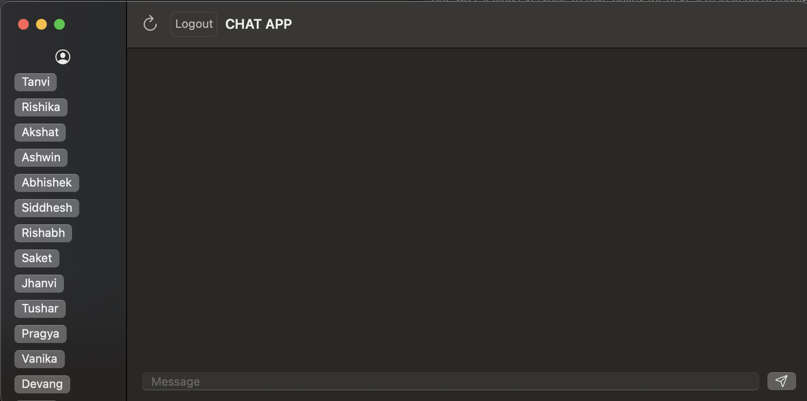

# ChatApp

Frontend application using [Chatterbox](https://github.com/haarshitgarg/Chatterbox) server. 
It currently has following features typical to a chat app

- login page
- Chat app page
- message window

## Login Page

Two fileds: `username` and `password`
Sends a request to Chatterbox server who can return 400, 401, 404, 500

## Chat App page

After the user is validated by the server, which also returns a jwt token, it switches the view to the application's main page. It requests the list of all friends and show them to the left. To the right you have message window.

